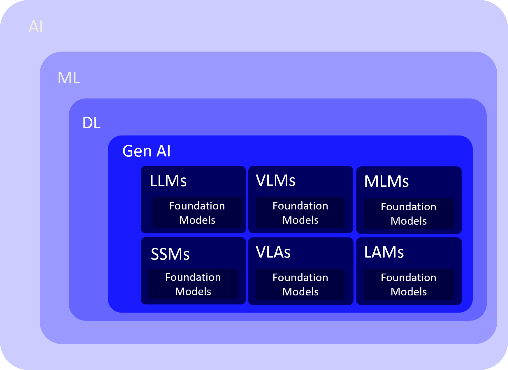
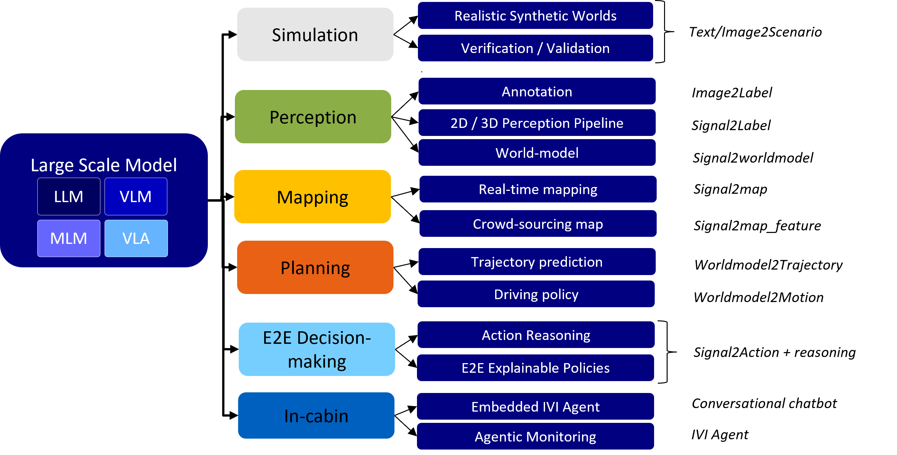
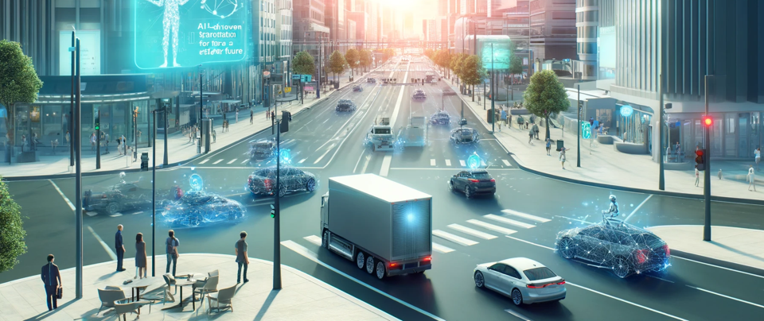

I recently had the pleasure of speaking to the students of the **Máster de Movilidad Cooperativa Conectada y Autónoma** at *Universidad Carlos III de Madrid*, sharing how Generative AI is reshaping every corner of automated‑driving R&D. My session, **“Challenges and Opportunities in Automated Driving in the Era of Agentic AI,”** argued that these new AI models are far more than hype, they mark a genuine shift in the way we design, test, and ultimately will trust autonomous vehicles. Here are a few highlights from the talk content.

I started by defining what *Generative AI* means to me. I find that these terms are often overused, and end up meaning different things to different people. In my mind, Generative AI is a subset of Deep Learning, a group of algorithms that *create* new data rather than merely classify existing inputs. Whether through *GANs*, *VAEs*, diffusion pipelines, *Transformers*, or state‑space networks, these algorithms learn rich distributions of data representations from enormous data corpora and when trained, they become foundation models such as *GPT‑n*. Unlike hand‑coded software, they’re trained statistical models that approximate facets of human cognition. Based on the type of data they were trained we will have multiple "flavors" of foundation models with different capabilities. 

So LLMs are not computer programs, they are "models". Here is an analogy I like: if a computer program is like a recipe with precise steps, a model, is like having a chef who has learned to cook by tasting countless dishes and understanding flavor combinations. You can ask this "chef" to create new dishes based on this data-driven (learned) understanding, even if they haven't seen that exact recipe before. 

But LLMs are made of code. The "program" in this case is the architecture of the neural network and the learning algorithm, 
while the "model" is the resulting set of learned weights and biases within that network.

After getting our basis, I turned to the autonomous‑vehicle (AV) pipeline itself, where applications today cover the complete AV development stack. From simulation for realistic synthetic world generation as well as verification and validation, to perception problems, creating maps, predicting road user behaviors and new conversational AI assistants for passengers.

On *simulation*, I touched on solutions like *Scenario Diffusion* from Zoox that conjure complex, multi‑agent traffic scenes conditioned on HD maps and textual prompts, or *UniSim* by Waabi, which transforms mundane driving logs into editable, photorealistic worlds. These synthetic environments slash the expense and risk of road testing while letting engineers probe rare edge cases at scale.

On *perception*, I showcased *DatasetGAN*, an NVIDIA technique that simplifies manual labeling tasks and wiht a handful of labeled images spanws vast troves of perfectly segmented data. 

One of the highlights on *planning* applicaitons is *BehaviorGPT* that impressed everyone with its ability to predict myriad plausible trajectories for every road user, capturing the uncertainty of traffic. 

And as we get closer to the frontier of **end‑to‑end decision making**. *DriveGPT4* shows how fused video perception with language‑model reasoning, can output low‑level control commands and natural‑language justifications for human consumption. 

Of course, no talk is complete without a **reality check**. I emphasized the twin troubles of scarce, high‑quality multimodal data and the scary computational appetite of today’s large models. Achieving sub‑100‑millisecond latency for LLMs on in‑car hardware is no trivial feat. Security and safety are very real threats (think prompt‑injection attacks, IP leakage, nondeterministic outputs, and opaque reasoning) all of these challenge regulators and engineers alike.

Yet the opportunities are equally compelling. Model‑compression tricks like *quantization*, *pruning*, and *distillation* can turn bloated networks into nimble binaries, while neuromorphic chips such as *Intel’s Loihi* handle spike‑based inference with astonishing energy efficiency. Safety, too, can be engineered: binding language‑model suggestions inside a rigorously proven shell like *Mobileye’s RSS* keeps behaviors within an acceptable envelope, and tools like *LVLM Interpret* begin to open the model’s “black box,” offering visibility into why a recommendation was made.

I closed by reminding people that the march towards full autonomy is a marathon, but Generative AI has armed us with fresh answers to old questions. If we address data, performance, security, and safety head‑on, we can unlock a future of **safer, more efficient, and more intelligent mobility**. The technology is here to stay; our task now is to wield it ethically, safely, and wisely.

Thanks for reading!
Contact me if you think the full content of this talk would be of interest to you or and audience of your choice.

*—Prof. Ignacio Alvarez*

