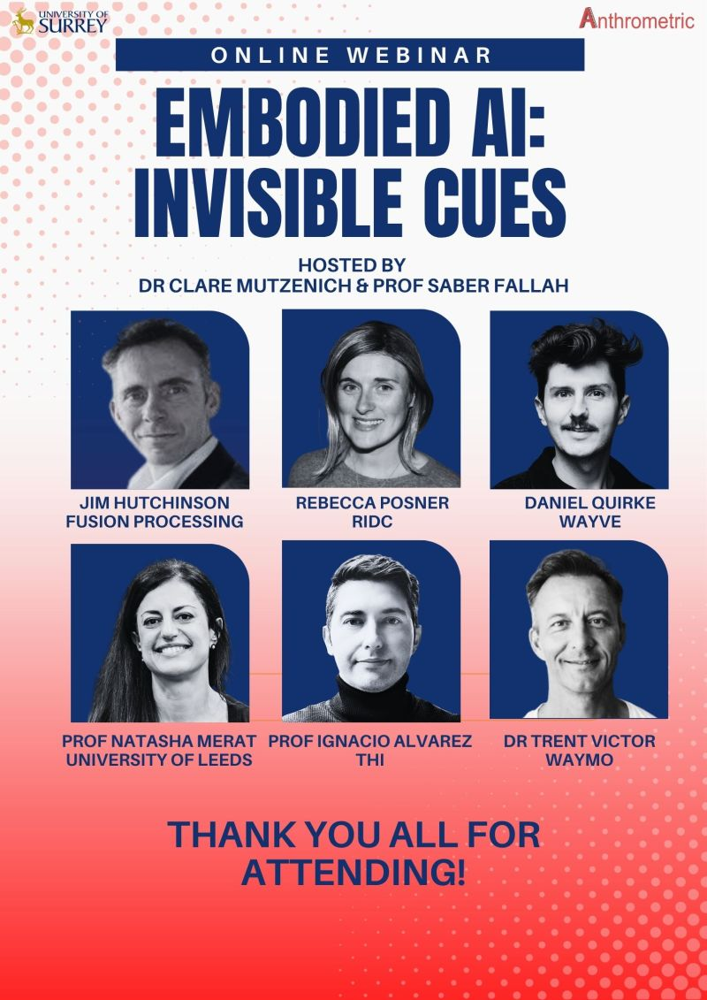
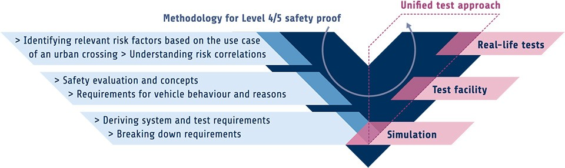

I recently joined a fantastic panel titled **“Embodied AI: Invisible Cues”**, hosted by *Dr Clare Mutzenich* and *Prof Saber Fallah* at the **University of Surrey**, with guests from *Fusion Processing, RIDC, Wayve, University of Leeds,* and *Waymo*.  
You can watch the full recording [here on YouTube](https://www.youtube.com/watch?v=nuHHnWmESXM).

I decided to write a little reflection based on the conversation there.

Over the last two decades my research has been developing at the intersection of **AI, Automotive Systems, and Human Factors** across industry and academia. I see *Embodied AI*, particularly in the vehicle context, as a **deeply socio-technical challenge**. It’s not only about engineering autonomy but also ensuring that intelligent systems understand, and are understood, by people.

Over the last 2 decades, but specially in the lats 5 years, technology advancements in AI have produced **"amazing algorithms"** capable of processing complex data, generalizing well, and making useful predictions. This is fueling the rapid deployment of embodied AI globally today. Still traffic conditions and driving behavior have strong locality effects, driving on the German autobahn is different from driving in India, a highway in Ohio, US flows very differently than a highway in Sichuan, China.

Because of that, embodied AI requires **richer context awareness**:  
- *From the AI side*, we need the ability to reason, perceive, and act with agency.  
- *From the human side*, we need the capacity to interpret and place the right level of trust on what the system is doing.

These AI-based systems are rapidly scaling worldwide, from Tesla to German premium automakers and, more recently, Chinese OEMs. However, they are all making the same mistake. Design locally, deploy globally doesn't work. We must design for **diversity**, validate for **local needs**, and ensure **transparency** to drive adoption. 

Let me break it down and walk you through my logic.

### AI Replacing Traditional Automation Pipelines  
We’re witnessing AI progressively replace classical vehicle-automation logic.  
Although most production systems remain **hybrid architectures** (that's AI plus deterministic model-based layers) the trend is clear. Companies like *Waymo*, *Wayve* and *Mobileye* are demonstrating how AI-centric stacks are now viable for real-world operation.

### Data-Driven Systems Need Verification & Validation  
With AI, validation shifts from checking control logic to **verifying embedded knowledge** and its **proper application**.  
Traditional Automotive verification and validation methods fall short. We need hybrid strategies that accurately measure how the model uses the knowledge embedded within and if any dangerous bias or sensitivityies have been introduced in the training data. 

This is still an open problem but we need to combine at least:  
- Simulation and synthetic data  
- Physical prototypes  
- User-in-the-loop testing  
- Continuous data audits

I really like Fraunhofer's work on safety processes (see the fig). But this is not a problem solvable by a single company. It requires collaborative efforts from the whole industry, including automakers, tier one suppliers, researchers, and government entities.

### Cross-Cultural and Contextual Dimensions  
Even if the technology can be developed, making it cheap enough for mass adoption is challenging. Achieving widespread affordability requires both a supportive regulatory framework, incentives for companies to invest fully, and continued research on the area. There are many, many people working on these. But there is an angle that often doesn't get proper attention. As AI-driven vehicles deploy globally, **cultural sensitivity** becomes essential.  
Traffic norms, trust in automation, and interaction expectations vary dramatically across geographies. Western-trained AI won’t behave intuitively in all contexts. Neither will Asian-trained AI. In the world we live today where AI sovereignity is becoming the norm, this technology protectionism will have negative effects. In essence, Automotive AI must learn to **“speak the cultural language”** of its users worldwide.

### User Expectations vs. System Behavior  
Unlike digital AI, *embodied AI* operates in shared physical environments.  
Users **feel** the vehicle’s motion, **see** its sensors, and **experience** its decisions.  
Transparency, that means understanding *why* the AI acts a certain way, is needed to build comfort and trust.  
A system that is legally correct but socially unfamiliar will still feel unsafe.

### The Problem of Transparency, Control, and Accountability  
Clear communication of **intent**, **authority**, and **decision boundaries** is crucial. There are many partially answered but generally unanswered questions like:  
- Who’s in control, the AI or a remote supervisor?  
- How and when should the AI system explain its reasoning?  
- How do we maintain calibrated trust?

These are not just technical questions, they are human-factors questions that to a large extend remain unanswered. They are clearly a research challenge and one that we must solve for all users, worldwide. 

### The Take-away  
No single actor can solve embodied AI alone. To make progress we need *cross-industry ecosystems*, *open frameworks*, and *shared validation protocols*.  
We must **design for diversity**, **validate for locals**, and **let adoption be driven by transparency**.

My proposal for this is to:
- Strengthen **industry-academia partnerships** to address real-world challenges  
- Run **multi-cultural trials early** to expose behavioral assumptions 
- Embed **UX and human-factors thinking** from the sensor to the interface level  
- Evaluate not only safety metrics but also **comfort, trust, comprehension, and cultural alignment**  
- Develop **governance frameworks** for the intelligibility and cultural fitness of embodied AI cues

So as the mobility sector races towards **AI-embodied vehicles by "sometime-sooner-than-you-think"**, the *invisible cues*, i.e. how systems signal intent, adapt behavior, and earn user trust, will define success.  
I truly believe embodied AI isn’t just about driving. It’s about **communicating**...  
Our task as a community is to ensure that intelligent vehicles can act safely **and** express their intent in ways that are intuitive across cultures.

*—Prof. Ignacio Alvarez*  