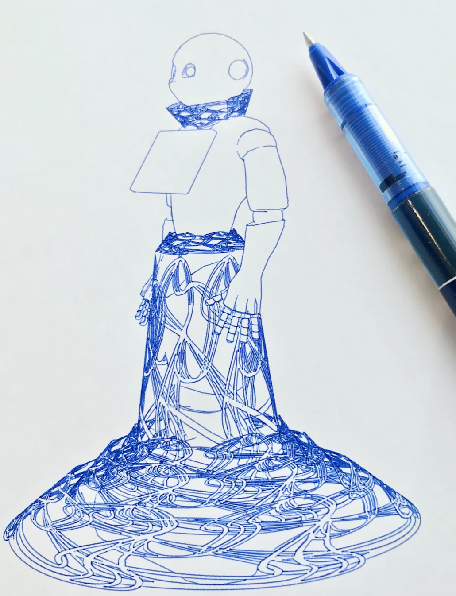
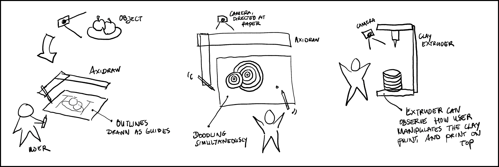
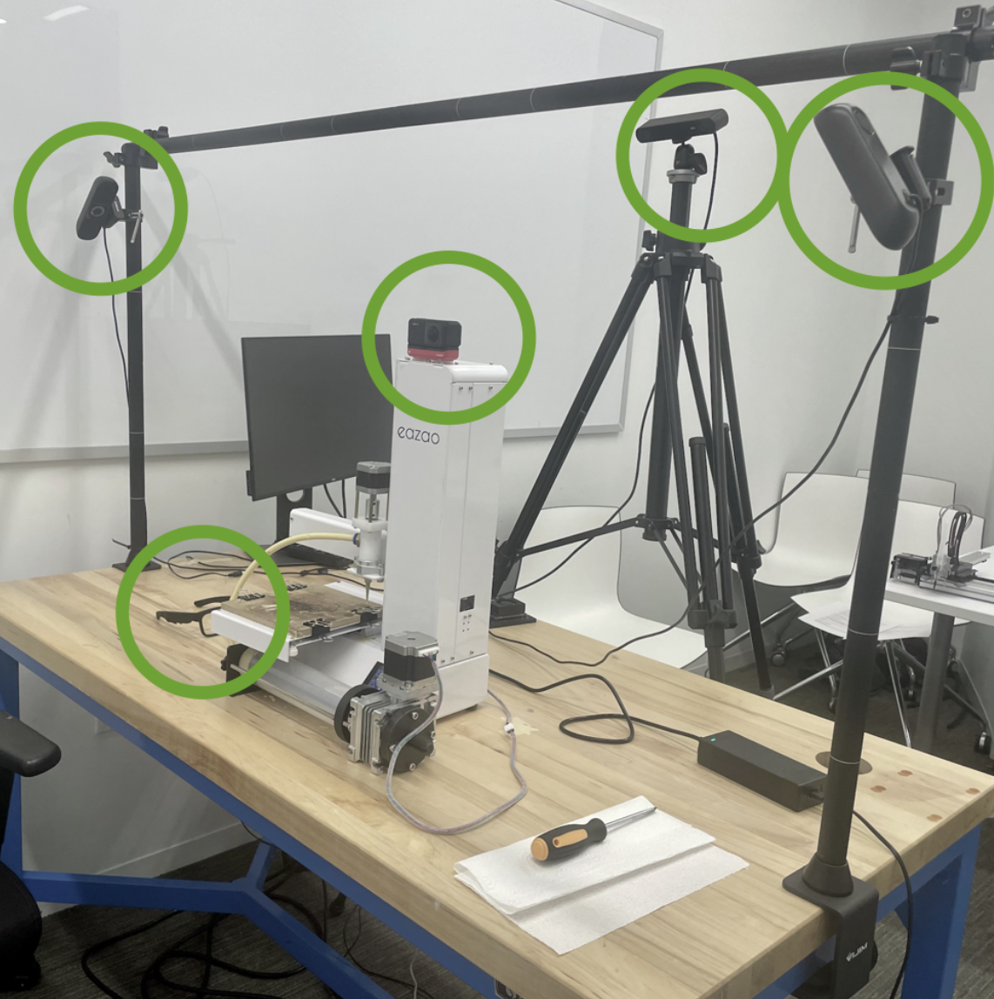
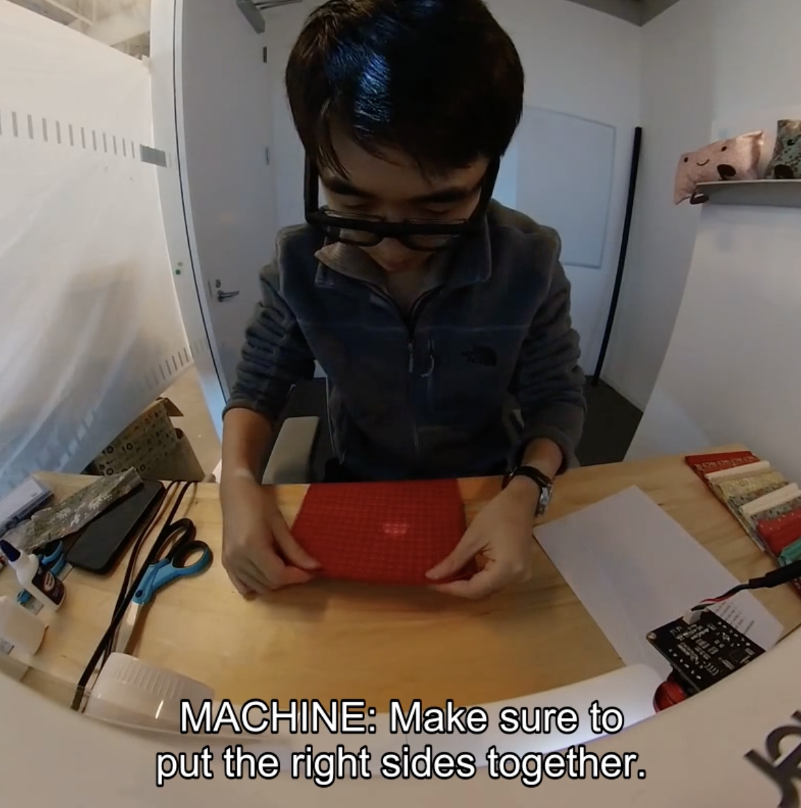

# Can a Machine Help You Make Something Without Taking the "Making" Away?

*HCIS Invited Talk Recap — Alexandra Bremers (Cornell Tech) on Mixed-Initiative Machines for Creative Tasks*

---

We recently invited [Alexandra Bremers](https://www.linkedin.com/in/awdb) to give a talk to our [HCIS team](https://hcis.ai/team). Alexandra recently received her PhD at Cornell Tech on the topic of Mixed-Initiative Machines for Creative Tasks. What follows is a summary of her presentation and the following discussion with the research team. 

Alexandra opened her talk with a confession. On the screen behind her was a beautifully detailed drawing of a Pepper robot wearing a dress. Crisp lines, fine cross-hatching, the kind of patient detail that makes you lean in. "I love drawing," she told us. "But I did not hold this pen."

The drawing had been produced by an AxiDraw pen plotter, a small, two-axis robot that moves an ordinary pen across a sheet of paper. Bremers had set it up, written the program, watched it work. The result was, by any reasonable definition, hers. And yet she had a question that wouldn't go away: *Is this really a drawing I made? And could I make it again?*

That uneasiness can be expressed as the sense that a machine had given her a gift while quietly removing the part she actually loved, drawing. This became the seed of her PhD dissertation, which she had defended at Cornell Tech a few days before joining us. Her central research question, she said, was almost embarrassingly direct:

> **How can machines support making without automating away the value of the process?**

What followed was an hour-long tour through six years of research, covering five design explorations, two empirical studies, two new public datasets, and a novel framework for thinking about creative tools that sits somewhere between human-computer interaction, robotics, and craft theory. Her work couldn't be more relevant in the current world were Agentic AI seems posed to take over both repetitive and highly creative tasks. Hers is s a question that quietly applies to most of us in 2026. Every time we accept an autocomplete, every time we ask an AI to "just clean this up," every time we wonder whether we still know how to do the thing we just delegated.

Let's dive in...

---

## Three ideas you have to hold in your head first

Before showing any of her own work, Bremers spent a few minutes establishing the theoretical scaffolding. It's worth doing the same here, because these three ideas are doing a lot of quiet work later on.

**Richard Sennett on craftsmanship.** The act of making, Sennett argues, has intrinsic value, a value that lives in the *process*, not just in the finished product. Skill develops through embodied engagement with materials. You learn pottery by feeling the clay resist your hands, not by reading about it. The risk of automation, then, isn't just losing jobs; it's losing the very loop through which humans become skilled in the first place.

**Donald Schön on reflective practice.** Schön studied how professionals (architects, engineers, even psychotherapists) actually work. His finding: experts don't follow a pre-written script. They take an action, observe what happens, and let the feedback shape their next move. He called it "a conversation with the materials of a situation." Machines that take over decision-making, Bremers warned, can short-circuit that conversation entirely.

**Eric Horvitz and Wendy Ju on shared control.** Horvitz's concept of *mixed-initiative interaction* describes interactions where the human and the machine each take initiative depending on who is best positioned at any given moment: neither of them dominate the entire interaction. Bremers's advisor, Dr. Wendy Ju, extended thinking about initiative with a second dimension: *attentional demand*. As described in her framework of implicit interaction, some interactions happen at the foreground (explicit commands, alarms) and some at the background (an ambient hum or a peripheral light). The intriguing zone is the *background-proactive* quadrant: a machine that takes initiative quietly, without yanking your attention away from the work.

Hold these 3 thoughts together and the rest of the talk falls into place: making has intrinsic value, expertise emerges from a feedback loop, and a good collaborator knows when to step forward and when to fade.

---

## Part 1: What do makers actually want?

Bremers's initial field work looked at *maker entrepreneurs*. That's people who design, produce, and sell handcrafted goods. Hair clips. Guitars. Tennis rackets. The kind of people who, when their day job ends, pick up a torch or a needle and start making things they then sell on Etsy or at local markets.

The interviews surfaced a tension that, in retrospect, defines the whole field. On one hand, makers spoke about the act of making as the most valuable part of their work. A welding instructor described his typical customer: "They’re a marketing professional who dresses nicely and goes to respectable places. They come here and get to make a lot of noise and sparks... hopefully their friends notice, and they get to brag on themselves and say: *I made that*."

That phrase: *I made that* is the entire reason the customer drives to the workshop instead of buying something pre-made online.

On the other hand, the same makers desperately want help. A gem cutter, a biochemist by day, told Bremers how fulfilling it was to "sit down in an evening, finish a gem, hand it off to a satisfied customer". But in the same conversation she mentioned the repetitive strain injuries the work caused. Other makers mentioned the chaos of trying to manage invoices and supply orders out of a WhatsApp thread.

So makers desperately want automation support but not the support that takes away their creative value. Not the kind that replaces them fully at the bench. The kind that handles the parts of the job that have nothing to do with the joy of making.

The takeaway: any machine that wants to be a good collaborator has to **preserve the process, support agency, and adapt to expertise**; while still helping with the parts that hurt.

To explore what that could feel like, Bremers offered three vignettes, three different relational frames a machine might occupy:

- **The companion**, humming alongside you while you work, emphasizing the joy of the process.
- **The guide**, stepping in for the parts you struggle with (say, getting proportions right) so you can focus on what you love.
- **The adaptive collaborator**, observing in real time and reacting to what you do.

These aren't mutually exclusive. They're more like keys a system might modulate between. Five small design probes: a tic-tac-toe game on paper, a shading algorithm implemention called Shade Bot, iterations of Wizard-of-Oz collaborative drawing rigs, a pen plotter with extra motors that could wave and gesture, and a cardboard mock-up of a sheet-metal bender. These experiments gave Bremers a feel for the dimensions of the design space: turn-taking, shared authorship, real-time collaboration, expressive movement, and physical scale.

---

## Part 2: How do you even *see* what's going on?

Here we pivoted from "what should we build?" to a deceptively basic methodological question: *if we want a machine to assist makers in real time, what does it actually need to perceive?* And, as a precursor to that, what's the minimum sensing rig a researcher needs to study these interactions in the first place?

Bremers ran a study with twelve novice participants across three tabletop fabrication machines: a pen plotter, a clay extruder, and an analog sewing machine with nothing but mechanical dials. Each participant tackled three ten-minute open-ended tasks: build a cylinder out of clay (deliberately rigged so it would collapse without intervention), turn a pen plotter's spiraling motion into watercolor art, and join two pieces of fabric on the sewing machine.

She instrumented the workspace with five cameras: a 360-degree camera mounted on the machine itself, camera eyeglasses worn by the participant, and three room-mounted cameras (front, left, right). Then she ran the videos through frame-by-frame pose estimation and qualitative interaction analysis to see which viewpoint captured what.

One of the most striking moments of the talk came when Bremers played a clip of a participant struggling with the sewing machine. He was sewing the wrong direction. He'd accidentally detached part of the presser foot by pulling the wrong lever. He never said a word about needing help, but anyone watching could see it: his gaze flicking around, his shoulders tensing, his hands stalling. Eventually he just gave up.

The lesson is clean: **implicit behavioral cues like hesitation, gaze shifts and postural changes frequently precede explicit requests for help.** If a machine could read those signals, it could intervene before frustration peaked. Whether that's a good idea is a separate question, and one Bremers tackles in Part 3.

The camera-by-camera analysis produced a seemingly boring yet useful conclusion: for novice fabrication contexts, you don't need an elaborate sensing rig. A 360-degree camera mounted on the machine plus an egocentric (eye-tracker) view captures the majority of what matters. Room cameras become important if you're studying experts, whose gaze doesn't reliably follow their hands, or if you need fine-grained machine-state visibility.

She formalized this into a three-step instrumentation protocol — identify the affordances and characteristics of interaction moments that matter, pick the camera angles that capture them, then iteratively test the minimum combination using staged piloting — and is planning to share the **FabriCam-5** dataset of synchronized video, pose, gaze, audio, and annotations from the study. Future researchers can use it to train models for hesitation detection or behavior classification without re-running the whole study.

A small but charming finding: success in creative tasks is *radically subjective*. One participant called the clay task a failure caused by the machine. Another called it a success because they'd successfully fixed the machine's mistake. One sewist was thrilled with a squiggly seam; another was disappointed by two straight lines. Any system that judges creative progress by output quality alone is going to misjudge many of its users.

---

## Part 3: Does it actually feel better when the machine takes initiative?

The capstone study tested the question the rest of her dissertation had been building toward. If a machine *can* read implicit signals, *should* it act on them? Or does proactive help feel intrusive, patronizing, or even annoying?

Twenty novice participants were asked to sew a small pillow with eyes, a mouth, and legs, using a sewing machine that could "talk." The setup was, again, a Wizard-of-Oz: a hidden experimenter watched four live camera feeds and triggered the machine's voice responses through scripted hotkeys (with a free-text option for novel situations). A small projected dot on the work table let the machine "point" at things.

Each participant did the task twice, in counterbalanced order, under two conditions:

- **Active.** The wizard intervened proactively, based on behavioral cues, the current task stage, or near-miss situations.
- **Passive.** The wizard responded only to explicit questions or actual errors.

After each task, participants rated the help on Likert scales, including clarity, helpfulness, timeliness, annoyance, and trustworthiness, and then sat for a semi-structured interview.

The headline result: **active assistance was rated significantly more *timely* than passive assistance.** Effect size was large; the result survived correction for multiple comparisons. Helpfulness trended higher in the active condition too, though it didn't survive the same correction. Crucially, there was *no* statistically significant difference in annoyance, clarity, or trustworthiness. The proactive machine wasn't experienced as nagging, and it wasn't experienced as untrustworthy.

Task completion times told a different story: there was no significant difference between conditions, but a strong learning effect across tasks. Whatever benefit proactive assistance brought, it lived in the *experience* of the work, not in raw efficiency.

The qualitative data was where the talk got really interesting. Several patterns recurred:

**Participants needed a moment to learn how to talk to the machine.** Early in the task, when the machine asked what they were trying to make, several participants didn't realize they could simply… answer. The conversational interface had to be discovered, not assumed. (Once people figured it out, two of them named the machine. One named it *Marceline*, then asked Marceline how she liked the name. Marceline said *she liked it just fine*.)

**Voice alone was often not enough.** The infamous "right sides facing together" instruction for sewing inside-out first, involving spatial orientation of fabric that is difficult to communicate verbally, had to be rephrased repeatedly, even with the projected pointer to indicate where the issue was. Sometimes the wizard had to type novel responses in real time, which introduced a clear lag.

**Participants valued the machine's *presence*, not just its guidance.** One participant, after struggling with the sewing machine, decided to hand-sew a difficult seam herself. The interaction that followed wasn't about instruction; it was about quiet companionship while she worked.

**Humor landed.** Tense situations, such as a participant struggling for a long time on a difficult part, were alleviated with the machine stating "Don't worry, it's not like I am going anywhere."

And one participant articulated a thought highlighting an unexpected benefit of AI: *"One thing [that] is good about it being AI and not human, is that if there was a human helping you, there’s always this feeling that they might just intervene and do it themselves. Because if my mom was there or a teacher, they might just say, okay, let me do this tricky part. And now I had to do these tricky parts myself because the AI was limited in not having physical motor skills, but just being able to talk."*

In other words, the machine was helpful precisely *because* it couldn't take over. It could only support.

Another participant noted that preferences would change with skill: *"If I’m doing something that I enjoy because I enjoy doing it, I want to have full control over the entire thing and I don’t want to offload any aspects of it. Whereas for something that’s kind of more introductory, it’s kind of like coaching"*

Bremers is also planning to release the **CoSew-4 dataset** from this study (twenty novices, forty tasks, with pose, facial actioncues, audio, Likert ratings, and interview transcripts), now waiting on its accompanying publication.

---

## Six design principles for machines that help you make things

Bremers closed the research portion of the talk with six principles that emerged from the work — small, opinionated, and worth pinning to a wall:

1. **Timing matters as much as content.** A correct answer at the wrong moment is the wrong answer.
2. **Attend to implicit signals, not just explicit requests.** Hesitation, gaze, and posture often precede the question.
3. **Subjective experience diverges from efficiency.** How users *feel* about an interaction matters independently of how fast they finish.
4. **Social and emotional dimensions matter, not just functional guidance.** People named these machines. They thanked them. They appreciated the social support from them.
5. **Adapt initiative to expertise.** What helps a novice will feel intrusive to an expert.
6. **Preserve human agency in creative decisions.** Augment the making process. Don't replace the human in it.

None of this generalizes cleanly to expert makers or industrial environments. At least not yet. But as a generative foundation for the next decade of work, it's solid ground.

---

## The discussion

The Q&A at HCIS ran almost twenty minutes and explored the future possibilities of Bremers's work:

**On expertise:** I asked Bremers what she thought about the future of expert makers working with AI. I was particularly interested in how their mental models of the AI shape how they plan their work. Her answer was striking. There's enormous individual variation: some artists are evangelists for AI in their workflow, others are flatly opposed. But across the maker entrepreneurs she interviewed, a clear pattern emerged. They didn't specifically want help with the *making*. They wanted help with everything *around* it: invoices, ordering, scheduling, the administrative chaos that lived in a WhatsApp thread on someone's phone. The honest answer to "how should AI help expert makers?" might be: stop trying to help them make. Help them with the parts of the job they already wished would go away.

**On de-skilling:** We are in the middle of a slow de-skilling crisis as AI gets better at the things humans used to learn by doing. But Bremers's point of view flipped the framing in a way I found genuinely useful. She told the story of a participant learning pottery on a wheel. She couldn't even get past the first step (centering the clay) without ruining the piece, and she nearly quit out of frustration. What if the machine, Bremers asked, behaved like the bumpers in a bowling alley? Not doing the work for you, but keeping you out of the gutter long enough to keep practicing. **Look for the points where users get frustrated and quit. That's where assistive intervention preserves skill rather than replacing it.** Reframed that way, the machine isn't a shortcut. It's a teacher who knows when to give you a break. This is a very useful framing that AI assistant designers need to adopt.

**On longer term Expert-AI collaboration:** We explored the question of whether the physical form of fabrication machines themselves should change for novices versus experts. Bremers's answer revealed a deep point about expertise itself, drawn from Schön: many creative skills aren't really skills you can *master*, because every situation is different. A sewist who makes pants every day is, in some sense, a novice when she tries to sew a shirt. Workers at the sheet-metal shop she visited got new orders every day: boxes, brackets, even spaceship parts, etc. And each new design pulled them back across the novice/expert line. The line is blurry. Tools that adapt continuously, rather than tools designed for a single skill tier, are probably the better bet.

**On customizable, modular augmentations:** We explored the idea that users could share augmentations with open-source enhancements you tune to your own machine and your own habits, then publish for others. Bremers said it was exactly the kind of direction she's thinking about as she considers what comes next. She's weighing two paths: a hardware add-on that bolts onto existing machines and makes them smarter and safer, or an AR-glasses-style assistant that travels with the user across tasks (sewing, but also cooking, which her participants kept bringing up unprompted).

We closed with an exciting exchange on **agency and control and how to *measure* them**. It's hard, we agreed, partly because the field doesn't yet have great methods for analyzing made artifacts as evidence of process. Bremers pointed to Miriam Sturdee's work on analyzing drawings as a starting point. Interview questions about pride and ownership are another tool. And small design choices matter too: in her study, participants were not paid but they got to keep the plushies they made. That single design decision, she suspects, increased their investment in the outcome and changed the data.

A small, lovely consequence: one participant decided to hand-sew a difficult seam rather than let the machine help, because she cared more about the plushie being *hers* than about following the protocol. The dataset captures that choice. It's a quiet refutation of any view that treats the human as a variable to be optimized.

---

## Why does this matter?

Bremers's PhD lives at an unusual intersection. It's empirical HCI in its methods, but its sensibility is closer to design than to typical human-AI interaction research. The through-line is a stubborn ethical commitment: *don't take the making away from the maker.*

That commitment is going to be tested, hard, over the next few years. Voice models, vision-language models, and embodied AI are converging on capabilities that will make Bremers's Wizard-of-Oz machine look quaint. But we are arriving at a point where the question stops being *can the machine do this for you?* and starts being *should it?*... and on what terms, and toward what kind of skill, and with what kind of presence?

Her research suggests an answer that's neither techno-utopian nor reactionary. **Build machines that pay attention**. Let them act before being asked, but only sometimes. **Make them companionable but limited**. Help with the boring parts. **Stay out of the joy**.

It sounds like a tall order right? Well, yes... that's why we invited her and why you should talk to her too :)

---

*Alexandra Bremers recently defended her PhD at Cornell Tech under the supervision of [Prof. Wendy Ju](https://www.wendyju.com/). Her dissertation, "Towards Mixed-Initiative Machines for Creative Tasks," is available through the Cornell library. The FabriCam-5 and CoSew-4 datasets will be released on Harvard Dataverse alongside their accompanying publications.*

*Thanks to [Alex](https://www.linkedin.com/in/awdb) for a generous and thoughtful talk, and to the HCIS team for the great questions.*

Prof. Dr. Ignacio Alvarez