

How to Upskill Without Giving Away What Makes You Valuable

<strong>Ignacio Alvarez</strong> &nbsp;&amp;&nbsp; <strong>Areen Alsaid</strong>

June 2026 &nbsp;·&nbsp; ~15 min read

## The Pressure to Become AI-Relevant

Areen and I are both professors at university; one in the US, the other in Europe. Besides research, we usually chat about the cultural differences we see in our respective academic worlds, but the story that inspired this post is the same on both sides of the Atlantic and everywhere else in the world.

A student knocked on my office door a few weeks ago, sat down, and asked me a question that many of you have been thinking about too: *"Professor, by the time I graduate, will any of this still matter?"*

<aside class="fg-callout" id="c1" data-ref="c1"><strong>The Hook:</strong> Find out why learning AI matters, and why protecting your human value matters even more.</aside>

She is working on her master's thesis in User Experience Design. She was not lazy, and she was not naive. She was tired. Tired of every podcast, YouTube video, and TikTok telling her to "adapt or be left behind." Tired of recruiters dropping the phrase "AI fluency" into job posts as casually as they once asked for Excel.

We have been hearing versions of these questions almost every week for the past year and a half. From students entering the labor market. From senior engineers working at large corporations worried their craft is being silently commoditized. From designers in a quiet race against the very tools they use. From parents in their forties who were just told their company is "rolling out an AI strategy," which everyone in the room understood as a polite synonym for *rolling out fewer of you*. 

So we decided to write this post about dealing with the pressure to become AI-relevant. We know it is not easy: Use AI too little and you look slow. Use AI too much and you risk training the next model that any colleague can also call. However, we think there is another way forward.

## The False Choice

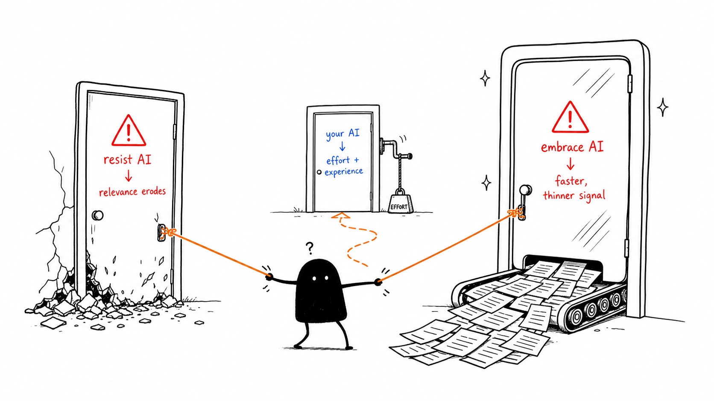

The current narrative wants you to pick one of two doors.

**Door 1:** Resist AI, be a purist. This risks watching your relevance erode as everyone else becomes faster and more efficient than you. When AI crashes you'll be the last one standing.

**Door 2:** Embrace AI completely, let it write your emails, your code, your slides, your strategy. Basically, move faster and delegate your low-level thinking to cohorts of AI agents at your service. 

We think both doors are wrong. Door 1 is sentimental. Door 2 is far more dangerous than it looks, because it disguises itself as productivity.

Here is the truth: **bad upskilling teaches people to produce faster while thinking less.** As your output volume goes up. The signal that was uniquely yours goes down. The output dashboards might say you are doing more, but you won't notice the dangerous trade-offs. The good news, is there is a third door.

<aside class="fg-callout" id="c2" data-ref="c2"><strong>The hidden risk:</strong> Did you know astronauts in zero gravity lose up to 20% of their muscle mass in just 5 to 11 days, and roughly 1% of bone density per month? Not because anything dramatic happens, but because the load disappears. Our bodies are brutally efficient, they stop maintaining what they don't need. The unsettling part isn't the loss, it's that astronauts feel fine while it's happening. They only notice when they try to stand on Earth again.</aside>

**Door 3:** Make AI yours. This requires effort, but we think it's worth it.

## Human Experience Is Not the Leftover

When we say *human experience*, we are not saying *humans have souls and that is what makes us special*. We mean something more concrete and more useful: human experience is a bundle of capabilities that current AI systems do not actually replace, even when they appear to. Look at the work our students, our colleagues, and our former teammates do best, and the things that hold value over time are recognizable:

- **Lived experience.** What you learned by failing in public and trying again.
- **Contextual judgment.** The way in which you can read of a room, a culture, a market, a meeting.
- **Values and taste.** Knowing which of three good options in front of you is the *right* one for *this* situation.
- **Moral reasoning.** Asking whether something *should* be done, not just whether it *can*.
- **Tacit knowledge.** The muscle memory of a craft that you cannot fully articulate.
- **Social sensitivity.** How you can read the tone, holds disagreements and repair trust with colleagues.
- **Embodied understanding.** What your body knows about the world that no transcript captures.
- **The ability to care.** Demonstrated by sustained attention to someone or something that is not yourself.

No matter how much data AI processes, these are capabilities that are impossible to replace. If you think about it, they also embody the meaning of our work lives. People feel proud of their achievements, of course, but after that they remember the experiences and miss the social interactions with their co-workers.

This is also why this post is not, anti-technology. Our message is not *human good, machine bad*. Our message is *know what you bring*. If you do not, the system will happily tell you that you bring nothing, and price you accordingly. 

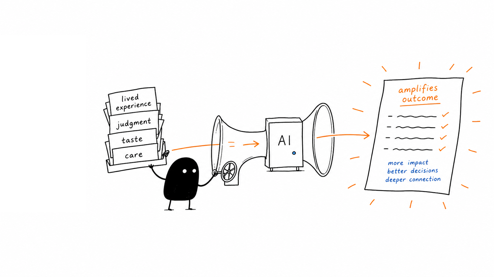

<aside class="fg-callout" id="c3" data-ref="c3"><strong>The blunt truth:</strong> a recent Nature paper, <a href="https://www.nature.com/articles/s41550-026-02837-2" target="_blank" rel="noopener">LLMs are not the problem</a>, put it this way: "the anxiety around AI is misplaced... if your contribution can be replicated by a process with no understanding of the underlying domain, the work was never sufficiently yours to begin with."</aside>

## From Replacement to Amplification

The question we keep being handed — *"How do I compete with AI?"* — is the wrong question. It assumes a race on a single track, where speed is the only metric and there is exactly one finish line. Compete with a calculator at arithmetic and you will lose. Compete with a search engine at recall and you will lose. Compete with a language model at producing fluent average prose and you will obviously lose.

The better question is the one Doug Engelbart asked in 1962, way long before AI was fashionable: *how do we augment human intellect?* How do we build tools that make a human's good judgment land harder, travel further, and reach more people? Our advice is to replace your verb: **Stop competing and start amplifying.**

An example we love is what Gary Kasparov did with this idea after he lost to Deep Blue. Instead of sulking, he invented *advanced chess*: humans plus engines, working in pairs. What he found, and what years of follow-up have largely confirmed, is that for a long time the strongest entity on the board was not the strongest human and not the strongest engine. It was a thoughtful human paired with a competent engine and a good *process* for using it. The process did most of the work.

The same lesson is showing up across knowledge work right now. The big winners are not the people with the most powerful model. They are the people with the most thoughtful workflow. This means the future does not belong to the people who imitate machines best. It belongs to the people who learns how to build working relationships with machines, while deepening their own judgment.

<aside class="fg-callout" id="c4" data-ref="c4"> <strong>What makes performance?</strong>  In 2012, Google launched <a href="https://psychsafety.com/googles-project-aristotle/" target="_blank" rel="noopener">Project Aristotle</a> to figure out what made their best teams work. They expected it to be about talent, skills, experience, IQ. It wasn't. The strongest predictor of team performance was <strong>psychological safety</strong>: whether people felt safe enough to take risks, ask dumb questions, and admit what they didn't know.</aside>

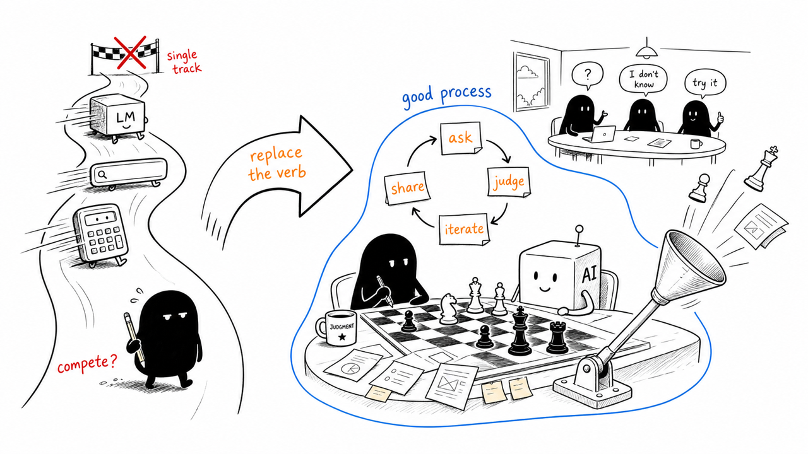

## The Digital Belt

So how do you build that working relationship in practice? In our discussions with students we have been calling it the "AI-tool belt" but to be more generic, let's call it the **digital belt**. 

<aside class="fg-callout" id="c5" data-ref="c5">The <strong>digital belt</strong> is a growing set of literacies, tools, workflows, and reflective habits that let you collaborate with AI effectively, without outsourcing responsibility for the result.</aside>

We like the belt metaphor because it captures four things that a "toolbox" or a "stack" do not. A belt is *modular*: you can add and remove items. It is *personal*: what hangs from a carpenter's belt is not what hangs from a climber's belt or a paramedic's belt. A belt is *worn on you*: it travels where you travel. Finally, a belt is *evolving*. You upgrade pieces, retire pieces, and the shape of the belt grows with the work.

Tools matter but knowing *when and why* to reach for which tool matters even more. We think the belt is the difference between owning a hammer and being a builder.

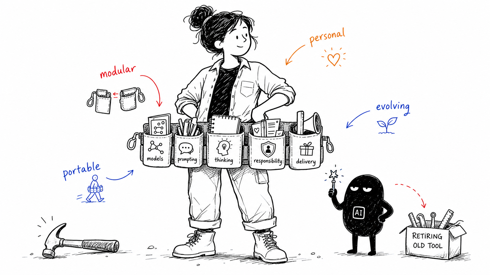

We organize the first version of the digital belt into **five clusters**. Think of them as the compartments on the belt:

- **Model Literacy.** Understanding what AI systems actually *are*: roughly how they are built, why they work, where they fail, and how they hallucinate. You don't need to know the math behind Reinforcement Learning with Human Feedback, but you need a good mental model.
- **Interaction Literacy.** Prompting, decomposition, iteration, context-setting, critique, evaluation. The ability to take a fuzzy real-world goal, break it into pieces a model can help with, scaffold the strategy, and phrase it in a way the model can understand. Then learning how to read its answers like an editor, rather than an audience.
- **Thinking Literacy.** Critical thinking, planning, systems thinking, design thinking, engineering thinking, judgment, reflection, creativity. This is the cluster AI does *not* replace. If you keep this one sharp, you can spend a lot of money on the other clusters and still come out ahead. If you let this one rust, you are doomed. There is a fundamental long-term limitation of the use of AI in knowledge work: with the right instructions, it can even do the thinking for you. But the longer you do that, the less you will understand what it is doing. You may be able to outsource your thinking, but you can never outsource your understanding. Staying sharp, then, requires you to use AI to sharpen your thinking literacy.
- **Human Responsibility Literacy.** It is also your responsibility to perform ethical reasoning, carefully design collaboration structures, always consider accountability, and to maintain the wisdom to know when *not* to automate. Some decisions have value precisely because a human owned them. Recognizing those decisions and protecting them is a skill. It is also, increasingly, a job description.
- **Delivery Literacy.** This is knowing how to ship: when to ship, and *when not* to ship. AI can produce drafts at a thrilling speed, but a draft is not a deliverable. Integrating AI output into a real product, report, and verifying it means putting your name on it, taking responsibility when it is wrong.

These five clusters are our belief for staying on top of AI no matter what the next model can do. They are the core of the belt. They are the core of your human value.

## A Belt Is Not a Toolbox

A toolbox is a collection of objects. A belt, by contrast, is a way of organizing capability around a person. It assumes the person and it is shaped by what the person actually does.

<aside class="fg-callout" id="c6" data-ref="c6">Think about driving. Knowing every feature of a car dashboard (the toolbox) is different from knowing how to drive in traffic (the belt). A good driver has learned to apply their judgment: when to brake, how to read other drivers. Most AI training today is a dashboard tour.</aside>

Most "AI training" on the market today is selling toolboxes like "twenty prompts you should memorize", "five new apps to install" or a "list of plugins that will 10x your output". None of that is wrong, we all find useful tricks this way, but it isn't your belt. The belt is the difference between knowing twenty prompts and knowing *which prompt this situation needs, why, and how to tell whether the answer is good*. That difference comes with your experience in applying AI to your own problems.

## What This Looks Like in Practice

You probably can picture this better if we give you some examples:

### For a Design Student

AI can sketch fifty exploratory directions in the time it would take you to outline three. That is genuinely useful. But the value you bring does not live in the sketches. It lives upstream, in *framing the problem in a way the AI never could have framed on its own*, and downstream, in *deciding which of the fifty directions actually serves the human you are designing for*. Use the AI to widen the funnel. Keep the funnel's mouth and the funnel's exit yours.

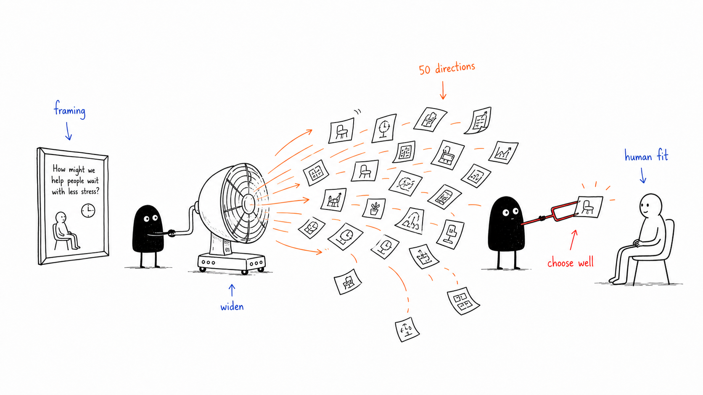

### For a Software Engineer

AI is a remarkable junior developer with infinite stamina, no memory of your codebase, and a confidence problem. It can produce code faster than you can read it. Your value moved up the stack. It is now in architecture, in debugging the *assumptions* (not just the lines), and in reasoning about systems, security, and team coordination. The engineers we see thriving with AI today treat its output the way a senior reviewer treats a junior PR: with curiosity, with respect, and most importantly, with a critical eye.

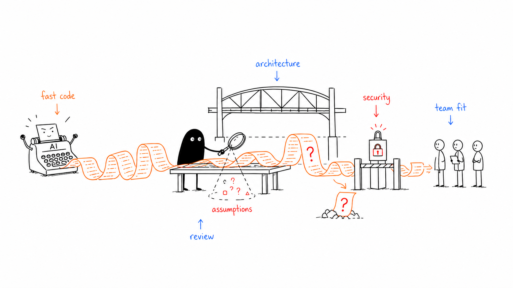

### For an HCI / UX Practitioner

AI can generate flows, mocks, and interface variants in seconds. But interfaces do not live in seconds. They live in cultures, in bodies, in trust relationships, in accessibility constraints. Your value as a human-centered practitioner is precisely in the territory the model does not see. You are the one who runs the study, watches the participant fumble, and reads the silence. None of that comes out of a prompt.

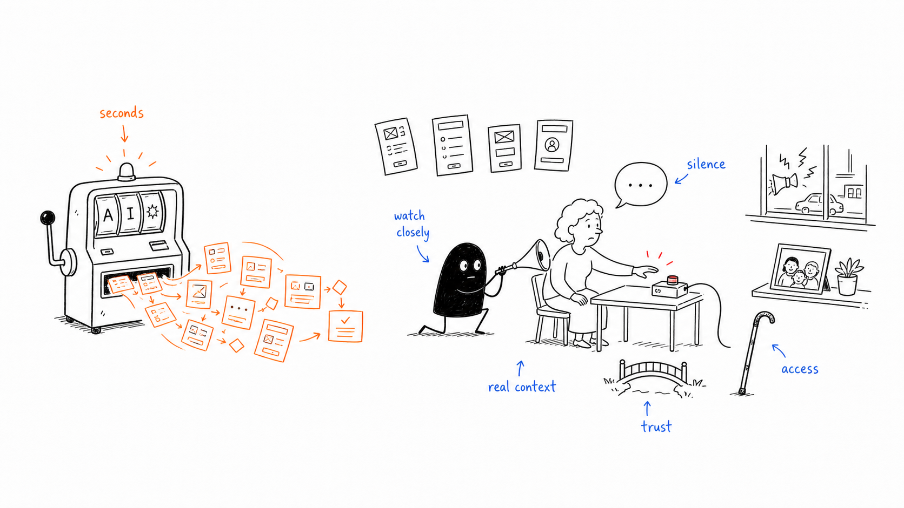

### For a Professional in Transition

If you are mid-career and re-entering the workforce after a layoff, a parental leave, or a pivot, the loudest message you are getting right now is "learn AI." That's fine, but remember this, the goal is not to become a prompt vending machine that any new graduate can outprice. The goal is to *pair* the domain experience you already have with the new AI collaboration skills. That pairing is rare and valuable. A 20-year supply chain veteran who can also drive an AI workflow is not competing with a fresh grad. They are in a different category.

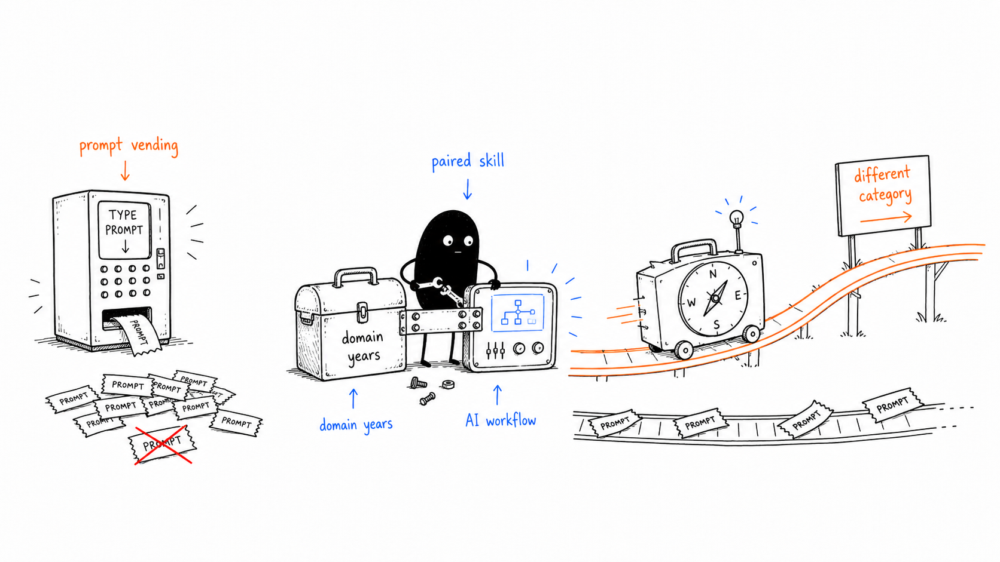

### For an Academic or Researcher

This is the case we live in personally. AI is changing how literature is reviewed, how data is processed, how figures are drafted, how grants are written. AI tools can accelerate discovery, but they can also flatten the slow, weird, intuition-driven thinking that produced most of the science we still cite. The belt for a researcher has to include AI fluency *and* a stubborn protection of unhurried thought. Speed is not the only academic virtue, and it might not even be the most important one.

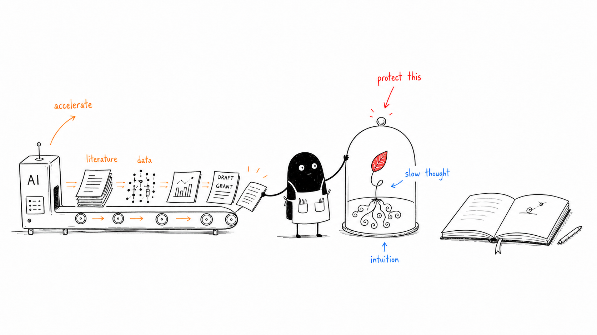

## AI Can Amplify People, but It Can Also Deskill Them

The real danger of AI is, in our opinion, quieter, more boring, and already happening. Sometimes efficiency comes at the cost of understanding, and you do not feel the cost until much later, when you reach for a skill and discover it is no longer there. **Not every efficiency is a gain.** 

<aside class="fg-callout" id="c7" data-ref="c7">Pilots who fly mostly on autopilot lose the manual stick-and-rudder feel they need precisely on the day the autopilot disengages. Air France 447 in 2009 is the textbook tragedy. The automation worked beautifully, until it didn't, and the humans in the loop were no longer the humans they would have been if they had been hand-flying all along.</aside>

This is not a new pattern. We have been here before, in other industries. In 1983, Lisanne Bainbridge published a paper called *Ironies of Automation* that anyone working with AI today should read. Her argument, roughly: the more we automate the easy parts of a task, the more demanding the remaining human role becomes, and the worse we get at it, because we no longer practice. The lesson generalizes. *If you only use the tool, you will eventually only be able to use the tool.*

The early empirical work on generative AI is starting to show the same shape. A [2025 study](https://www.microsoft.com/en-us/research/publication/the-impact-of-generative-ai-on-critical-thinking-self-reported-reductions-in-cognitive-effort-and-confidence-effects-from-a-survey-of-knowledge-workers/) surveyed knowledge workers and found a striking inverse pattern: the more confidence people had in the AI, the less critical thinking they reported doing. Confidence in their own expertise pushed in the opposite direction. The tool itself was neutral. What changed was *the human posture in front of it*.

A second piece of recent evidence studied the [impact of AI in consultancy business](https://www.hbs.edu/faculty/Pages/item.aspx?num=64700). They reported a "jagged frontier" of tasks GPT-4 was good at: AI-augmented consultants outperformed their unaugmented peers by a wide margin. *Outside* that frontier, on tasks the model was subtly bad at, AI-augmented consultants performed *worse* than the control group, because they trusted the confident-sounding output and turned off their own skepticism.

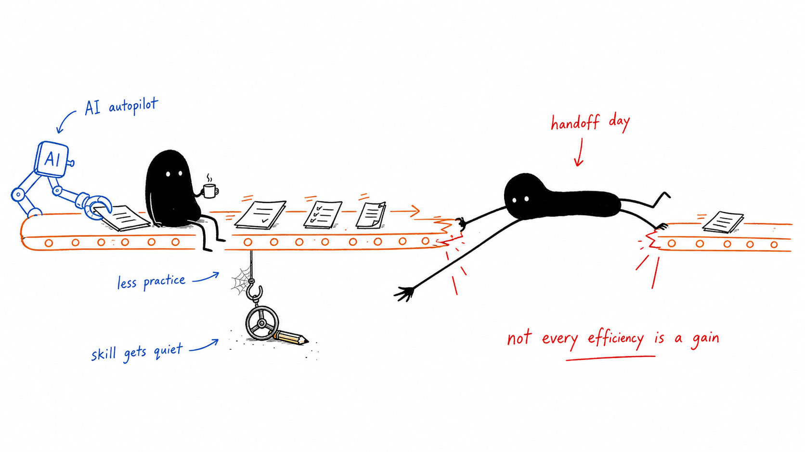

## What Upskilling Should Really Mean for You

If you take all of the above seriously, then "learn AI" has to mean more than "take a prompting course." We think, real upskilling is closer to learning a new language and a new workplace culture at the same time. It is technical, but also social, ethical, and reflective. The kind of education we believe in for this era teaches four things at once:

- **Learning how AI works.**
- **Learning how to work with it.**
- **Learning how to think with it.**
- **Learning how to resist letting it think for you.**

This is what education for the AI era has to become. Instead of training in a specific tool that will be deprecated in six months, we encourage the cultivation of *durable* capabilities you can carry across whatever comes next.

### A Quick Note on Safe AI Use

A digital belt that does not include safety is not a belt; it is a hazard. Three things deserve dedicated attention:

- **Privacy.** Treat any prompt as a potential disclosure. Default to not pasting client data, personal data, or proprietary code into systems whose data policies you have not read. The cost of getting this wrong is high.
- **Trust.** Both *over-trust* and *under-trust* are failure modes. Over-trust is the consultant accepting a confident but wrong answer because it sounded good. Under-trust is the colleague refusing to use AI for things it is genuinely good at and falling behind. The skill is calibration: trust the tool exactly as much as it has earned, no more.
- **Bias.** Models reproduce, and sometimes magnify, the patterns in their training data. Small biases can easily compound when humans defer to model outputs without inspection. If your workflow does not include a step where a human looks at the output through the lens of *who could this hurt*, your workflow is incomplete.

<aside class="fg-callout" id="c8" data-ref="c8">Researchers at <a href="https://www.nature.com/articles/s41586-026-10319-8" target="_blank" rel="noopener">Anthropic</a> showed recently that artificial intelligence systems trained on the outputs of one another, inherit bias properties in a process called subliminal learning that transmits behavioural traits through semantically unrelated data and suggest that safety evaluations need to examine not just behaviour, but the origins of models and training data and the processes used to create them.</aside>  

What can we learn from industries that already lived through this? Aviation went through it with autopilot. Medicine went through it with clinical decision support. Manufacturing went through it with CNC machines. When a tool becomes excellent, humans become rusty, and one day the tool reaches its edge and humans have to reach back. The professions that survived well are the ones that designed the human role *deliberately*, instead of letting it shrink by default. With AI, we are now that profession, all of us.

## Protect What Makes You Valuable

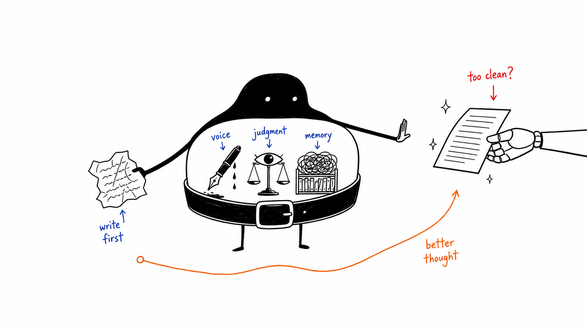

So if you are going to wear the belt, what do you protect? Here is what we think is most worth defending because these are the parts that, if you let go, you will not get back easily:

- **Language and Expression.** Writing is thinking made visible. The struggle of finding the right word is not inefficiency; it is the place where the idea actually forms. Rough drafts are how you discover what you actually believe. LLMs produce fluent language without interiority. The text might read beautifully but it means nothing in particular, because nothing was at stake when it was generated. Your voice is the residue of everything you have lived through, leaked into your sentences. That is the signal employers, students, readers, and friends are actually paying attention to. If you stop writing, you stop having thoughts you did not already have. You become a curator of AI prose instead of an originator of your own. The defense is small and concrete: *write before you prompt*. Use AI to refine, not to originate. Your raw, messy, embarrassing ideas is where the next version of you is hiding.
- **Critical Thinking.** Critical thinking is not a vibe, it is a set of habits: asking what you would have to believe for a claim to be true, looking for the opposing view, noticing when an answer feels too clean, checking citations, sitting with the discomfort of not yet knowing. AI will tempt you to skip those habits, because it serves you a confident answer before the discomfort even has time to arrive. *Slow down before you accept*. Ask the model to argue against its own answer. Ask yourself what you would have said before reading the AI's response. We think The point is not to be slower for its own sake, but to keep the critical thinking muscle.
- **Memory and Knowledge.** Human memory is lossy, emotional, and weirdly associative. We build expertise out of strange, half-remembered scraps that connect later in ways you could not have planned. If we offload all of it to AI retrieval, our expertise will hollow out. *learn things the slow way sometimes*. Explain a concept out loud without looking it up. Let yourself not know something for a few minutes before searching. Read whole books. Take walks and use them to let your thoughts wander. Be a little inefficient on purpose. Your future self will be the one who benefits.

## The Third Door

We want to end this blog coming back to the student into our office. The question was not whether *any of this* would still matter. It was which parts of *her* she was going to keep sharp while everything around her changed. The technology and the shift are real. So is the pressure, but none of those things are going away because we are anxious about them. 

<aside class="fg-callout" id="c9" data-ref="c9">The task ahead is not to become machine-like. It is to become more fully human, with better tools.</aside>

The people who will do well in the AI transition, are not the people with the best prompts. They are the people who keep their judgment, their voice, their care, and their craft, and who pick up the new tools without letting the new tools pick them up.

So if you take one thing from this post, let it be a short list of working principles for the next few years:

- **Build the belt, don't buy the toolbox.** Because tools change but fluency compounds.
- **Write before you prompt.** Be you first, refine second.
- **If you let AI draft make sure you decide.** Keep the direction of the arrow consistent.
- **Calibrate trust to evidence.** Always verify.
- **Protect the slow muscles.** Memory, judgment, reflection and taste.
- **Own the output.** If your name is on it, well, your name is on it!

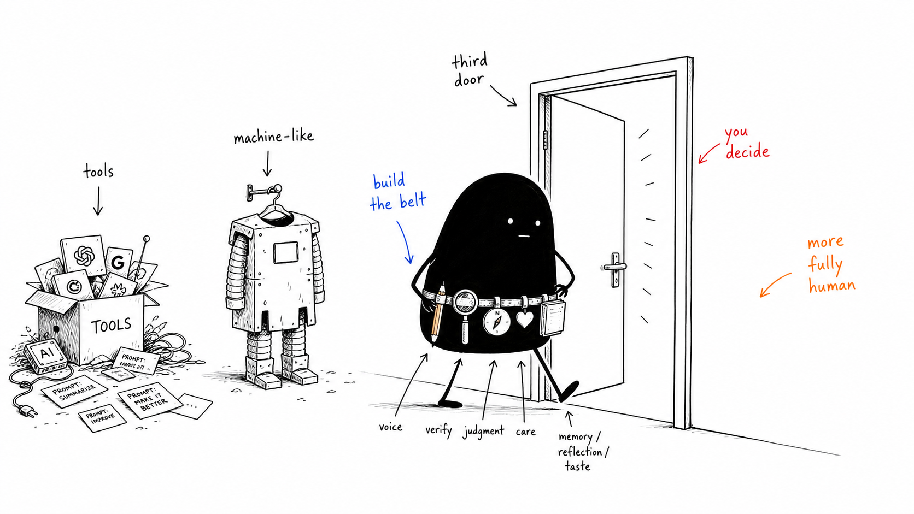

Now, go on and build your digital belt. Learn the tools, the workflows. Learn the language of AI. And protect the parts of yourself that no tool should replace. That is the third door. We will see you on the other side of it…

— Profs. Ignacio Alvarez &amp; Areen Alsaid &nbsp;·&nbsp; © 2026

