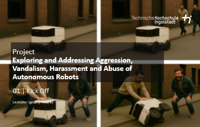

# Description
This course is designed to prepare students for their final thesis. It provides fundamental knowledge to develop a study design based on a problem definition, conduct the study, evaluate it, and interpret the results. Thematic clusters in the area of ​​human-computer interaction (e.g., productivity, automated driving, sports, and digitalization) are offered, from which student groups can choose and propose a specific topic. This topic will be developed iteratively in close professional coordination with the respective supervising lecturers. • Basics of user studies (possible applications, definition of research hypothesis) • Study design (dependent/independent variables, laboratory vs. field studies, within-groups/between-groups design) • Planning of experiments (different methods, “fidelity” of an experiment, software/hardware prototypes, Wizard of Oz studies, qualitative surveys/quantitative measurements, ethical aspects, role of an institutional review board (IRB)) • Study implementation (preparation, briefing/debriefing, finding and inviting test subjects, determining group size, learning effects, measuring variables/data collection) • Qualitative data analysis (content analysis, evaluation with MAXQDA/NVIVO, preparation and presentation of results, revision/fine-tuning in Illustrator) • Quantitative data analysis (reflection on the research hypothesis, use of SPSS for statistical evaluations, parametric/nonparametric statistics, correct choice of method, presentation and interpretation of results) • Written/oral presentation of the results (preparation of results, peer review process, final conference-style presentation)

Exploring and Addressing Aggression, Vandalism, Harassment and Abuse of Autonomous Robots
======
Recent developments highlight the growing role of automated systems in urban mobility. For example, autonomous delivery robots (ADRs), which facilitate contactless delivery, were increasingly used to support lastmile logistics during the COVID-19 pandemic. Additionally, Waymo's robotaxis have recently completed 150,000 commercial rides and cover approximately 1.6 million kilometers per week.
While these developments offer promising mobility solutions, ensuring broad public acceptance is crucial. One of the challenges currently faced is the risk of vandalism, harassment, and aggression against these systems, which can significantly impact safety, usability, and public trust. Addressing these concerns requires a proactive design approach that mitigates risks and enhances security.
Within this seminar, students analyzed aspects of aggression, vandalism, harassment, and abuse directed at autonomous robots (e.g. delivery service robots, automated vehicles) with the goal to develop interfaces and technological solutions that mitigate these risks while ensuring the vehicles remain safe and functional for all users. Based on an individual literature review (related work), students (in groups of two or three) identified key challenges and explored innovative concepts. be developed together in a dedicated brainstorming session and refined/substantiated by the individual teams (with feedback from the lecturer).

Student Project Details
======
Coming soon

Interested?
======
Contact me if you’d like me to teach this course to you or your audience.
