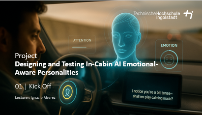

# Description
This course is designed to prepare students for their final thesis. It provides fundamental knowledge to develop a study design based on a problem definition, conduct the study, evaluate it, and interpret the results. Thematic clusters in the area of ​​human-computer interaction (e.g., productivity, automated driving, sports, and digitalization) are offered, from which student groups can choose and propose a specific topic. This topic will be developed iteratively in close professional coordination with the respective supervising lecturers. • Basics of user studies (possible applications, definition of research hypothesis) • Study design (dependent/independent variables, laboratory vs. field studies, within-groups/between-groups design) • Planning of experiments (different methods, “fidelity” of an experiment, software/hardware prototypes, Wizard of Oz studies, qualitative surveys/quantitative measurements, ethical aspects, role of an institutional review board (IRB)) • Study implementation (preparation, briefing/debriefing, finding and inviting test subjects, determining group size, learning effects, measuring variables/data collection) • Qualitative data analysis (content analysis, evaluation with MAXQDA/NVIVO, preparation and presentation of results, revision/fine-tuning in Illustrator) • Quantitative data analysis (reflection on the research hypothesis, use of SPSS for statistical evaluations, parametric/nonparametric statistics, correct choice of method, presentation and interpretation of results) • Written/oral presentation of the results (preparation of results, peer review process, final conference-style presentation)

Exploring and Addressing Aggression, Vandalism, Harassment and Abuse of Autonomous Robots
======
Empathic in-vehicle interfaces can detect and employ a variety of intervention modalities to change user affect and improve user driving experience, for example mitigating driver distraction associated with emotional states. The emotional tone and behavior of in-cabin AI assistants can also play a significant role in shaping user experience, trust, and satisfaction. Emotional awareness in AI is critical for delivering context-appropriate responses, fostering engagement, and ensuring personalized interaction experiences.
In this project, students customized AI agents to exhibit emotionally-aware behaviors that align with predefined user personas. Leveraging conversational design principles, they developed tailored conversational flows, focusing on tone, empathy, and adaptability of the AI agent. Usability testing was conducted to assess the assistant’s emotional relevance, user satisfaction, and the effectiveness of its personality in different in-car scenarios.
Deliverables included a fully implemented AI assistant prototype with emotional tuned performance, using services like ChatGPT or Speechify Studio, a usability evaluation report in an Automotive UseCase, and a critical analysis of the effectiveness of emotional-aware AI in the automotive context. Students also explored ethical considerations and challenges in designing emotionally aware systems.

Student Project Details
======
Coming soon

Interested?
======
Contact me if you’d like me to teach this course to you or your audience.
