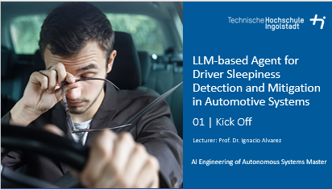

# Description
Ensuring driver alertness is a cornerstone of automotive safety, and Large Language Models (LLMs) offer a unique opportunity to create intelligent systems capable of detecting and mitigating sleepiness. By integrating multimodal inputs such as audio cues, video streams, and driving context signals, LLMs can process complex, real-time data to assess driver state and trigger appropriate actions to maintain alertness.
In this project, students will design and prototype an automotive agent powered by LLMs to detect and respond to driver sleepiness. The system will utilize multimodal inputs, such as facial expressions, voice tone, and driving behavior, to compute a sleepiness likelihood metric. Based on the metric and additional contextual awareness signals (e.g., time of day, driving duration), the agent will propose tailored interventions, such as adjusting cabin temperature, suggesting a rest stop, or initiating engaging conversations. Students will evaluate the system's usability, effectiveness, and user satisfaction, exploring the interplay between AI decision-making and driver interaction.

In this course, students designed and implemented a prototype in-vehicle game that incorporated input from an AV safety model, such as an AV agent equipped with RSS in the CARLA driving simulator to provide feedback on safety-related actions. Students evaluated their designed game for usability, engagement, and its effectiveness in increasing safety awareness in driving scenarios. Deliverables included a functional game prototype, an evaluation report, and insights into the application of gamification in AV safety education.

Student Project Details
======
Coming soon

Interested?
======
Contact me if you’d like me to teach this course to you or your audience.

