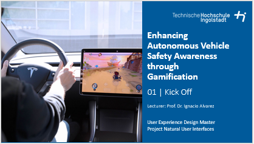

# Description
Educating vehicle passengers and drivers about safety in autonomous vehicles (AVs) can be a challenge, especially when technical concepts like the Responsibility Sensitive Safety (RSS) model are involved. Gamification offers an innovative way to enhance user engagement and increase awareness of AV safety principles through the more natural interfaces of games by transforming complex concepts into interactive and enjoyable experiences. Integrating a safety model like RSS into a game can provide users with real-time feedback on safe driving practices and decision-making in various scenarios, as well as improve overall situational awareness during non-driving tasks.

In this course, students designed and implemented a prototype in-vehicle game that incorporated input from an AV safety model, such as an AV agent equipped with RSS in the CARLA driving simulator to provide feedback on safety-related actions. Students evaluated their designed game for usability, engagement, and its effectiveness in increasing safety awareness in driving scenarios. Deliverables included a functional game prototype, an evaluation report, and insights into the application of gamification in AV safety education.

Student Project Details
======
Coming soon

Interested?
======
Contact me if you’d like me to teach this course to you or your audience.

