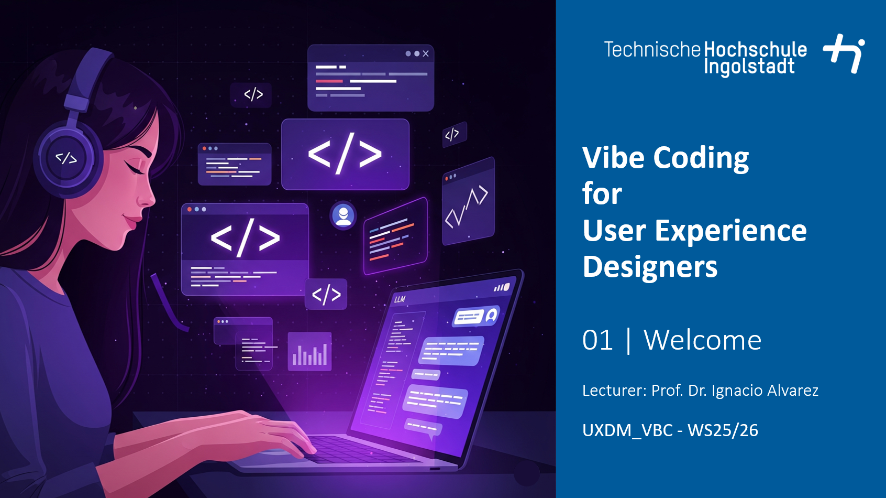

# Description
This course provides a practical introduction to the integration of generative AI and "vibe coding" into UX work-flows. Students will:
•	Explore foundational concepts of Generative AI, focusing on LLMs.
•	Learn techniques of prompt engineering to effectively direct AI tools.
•	Apply AI-driven methods to enhance UX research processes, from data collection to synthesis and prototyping.
•	Utilize AI-assisted development platforms, such as ChatGPT, Replit or Cursor, to prototype interactive user interfaces, tools and applications.
•	Investigate the emerging paradigm of Agentic AI and its potential to autonomously resolve user experience challenges.
•	Undertake a comprehensive final project, culminating in designing, building, and deploying a specialized AI agent addressing a defined UX issue.

Student Project Details
======
Coming soon

Interested?
======
Contact me if you’d like me to teach this course to you or your audience.