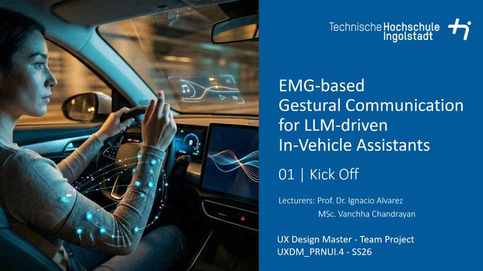

# Description
As vehicles become increasingly intelligent and assistive, the challenge of designing intuitive, safe, and low-distraction interaction methods becomes more critical. Voice, visual, and touch interfaces, though common and widely used, can be intrusive or unreliable in certain situations. Electromyography (EMG) sensors offer a promising alternative by detecting subtle muscle activations that reflect a driver’s intent or emotional state. These muscle-based gestures can enable silent, quick, and low-distraction communication between driver and vehicle systems, supporting a more natural, intuitive, and adaptive human-vehicle interaction.

In this course , students explore how EMG-based gestures can be leveraged to improve in-vehicle interaction and feedback. They will design and investigate how such gestures can support communication and feedback integration with an LLM-based in-cabin assistant. This includes how drivers might express intent, preferences, or reactions to system assistance through adaptive gestures; and how LLMs can interpret or adapt to such inputs to enable natural and context-aware interactions. Students will analyze how this modality for interaction affects overall usability, trust, and satisfaction, and examine how it complements/interferes with other modalities like voice or touch.

Student Project Details
======
Coming soon

Interested?
======
Contact me if you’d like me to teach this course to you or your audience.

