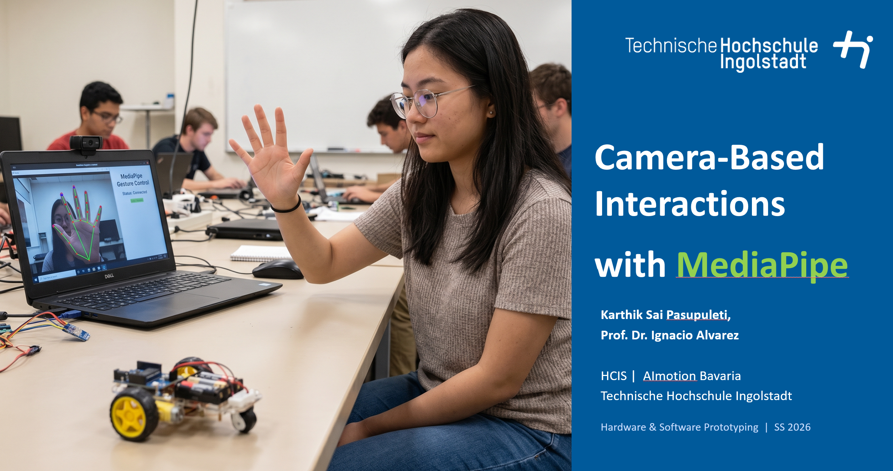

# Description
The course combines theoretical foundations with hands-on prototyping work in order to enable students to design and implement interactive physical computing systems.
Students work in interdisciplinary teams of three to design, implement, and demonstrate a functional prototype of an intelligent vehicle at scale 1:20. The project integrates concepts from electronics, embedded programming, physical computing, interaction design, and
rapid prototyping.
Each team includes complementary competencies such as: one student with strengths in product design/mechanical construction, one student with strengths in interaction or visual design, and one student with strengths in programming or embedded systems.
The aim of the project is to give students hands-on experience in designing interactive physical systems that combine mechanical construction, embedded electronics, and software-based control logic. Students will develop a working prototype that is capable of perceiving aspects of its environment through sensors and reacting to these inputs through actuators such as motors, lights, or other output devices.

This course was taught in combination with other profesors at THI. I teach 3 modules:

- Connectivity Patterns for ESP32 microcontrollers: At the end of this module students are able to select and implement an appropriate connectivity pattern (BLE vs. MQTT) and design a robust message flow (pairing, reconnects, timeouts) between a prototype and external systems.
- Camera-based interactions with Mediapipe: At the end of this module students are able to set up a MediaPipe pipeline on a webcam, read landmark coordinates from the Hand, Face and Pose models, smooth jittery values with a moving-average filter, and turn raw landmarks into useful application logic such as gesture recognition, drowsiness detection and head-controlled steering.
- Dynamic UIs: At the end of this module students can design and build a companion UIs that monitor and control a Automated Vehicle prototypes (1:20 real car), including clear state and feedback handling, integrate controllers with hand / facial gestures and can build robust UI patterns. 

Student Project Details
======
Coming soon

Interested?
======
Contact me if you’d like me to teach this course to you or your audience.

